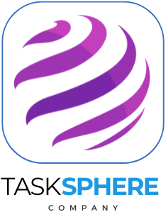

# TaskSphere

  

## Descripción del Proyecto

TaskSphere es una aplicación móvil innovadora diseñada para revolucionar la gestión de tareas diarias, equipos, horarios y vacaciones en los comercios. Con una interfaz intuitiva y herramientas de gestión poderosas, TaskSphere se convierte en una solución integral para negocios que buscan optimizar sus operaciones y mejorar la productividad de sus empleados.

En un entorno empresarial caracterizado por la rápida evolución tecnológica y la creciente competencia, muchas pequeñas y medianas empresas (PyMEs) enfrentan desafíos significativos debido a la falta de acceso a herramientas tecnológicas adecuadas para la gestión de empleados y la asignación y seguimiento de tareas. TaskSphere aborda esta brecha tecnológica, proporcionando una solución accesible, personalizable y escalable que potencia la eficiencia y competitividad de las PyMEs.

## Funcionalidades Principales

- **Generación y Delegación de Tareas:** Permite a los gerentes crear tareas y asignarlas a uno o varios trabajadores.
- **Establecimiento de Niveles de Prioridad:** Los usuarios pueden definir la importancia de cada tarea para una gestión más eficiente del tiempo.
- **Supervisión y Seguimiento Detallado:** Los gerentes pueden monitorear el progreso de las actividades de manera minuciosa.
- **Visión Global de la Productividad:** Ofrece una perspectiva general de la productividad a nivel empresarial e individual.
- **Administración de Horarios y Turnos:** Facilita la gestión de horarios laborales y turnos del personal.
- **Gestión de Vacaciones y Horas Extras:** Administra las solicitudes de vacaciones y las horas extras del equipo de trabajo de manera eficiente.
- **Envío de Notificaciones y Comunicados:** Implementa una función para enviar comunicados importantes y notificaciones a todo el personal rápidamente.

## Tecnologías y Herramientas Utilizadas

- **Java Enterprise Edition:** Para el desarrollo de la aplicación Android.
- **Firebase:** Para autenticación, base de datos en tiempo real y almacenamiento.
- **GitHub:** Para la gestión de código fuente y control de versiones.
- **Android Studio:** IDE utilizado para el desarrollo de la aplicación.
- **XML:** Para definir recursos como cadenas, colores, estilos y layouts.
- **RecyclerView y Adapter:** Para mostrar y gestionar grandes conjuntos de datos de forma eficiente.
- **WebSockets y SpringBoot:** Para la funcionalidad de chat en tiempo real.
- **Firebase Storage:** Para almacenamiento de contenido generado por los usuarios.
- **PostgreSQL:** Para la gestión de bases de datos relacional.
- **JSON:** Para el intercambio de datos.

## Contribuidores

- **Azahara Fonseca Escudero:** Diseño y desarrollo de pantallas de inicio de sesión, creación de nuevas cuentas y gestión de comunicados.
- **Alfonso Lobato de la Sierra:** Desarrollo de la funcionalidad de fichajes, gestión de tareas y roles, notificaciones, y microservicio de chat.
- **Alejandro Martín Fernández Prieto:** Diseño del logo, splash screen, interfaz gráfica del calendario y gestión de solicitudes de vacaciones.

## Estructura del Proyecto

El proyecto está dividido en dos carpetas principales:
- **TaskSphere:** Contiene el proyecto de Android Studio con el código principal de la aplicación.
- **Chat-TaskSphere:** Contiene el microservicio de chat hecho con SpringBoot, incluyendo un archivo Dockerfile para generar el contenedor en Docker y desplegar el servicio.
